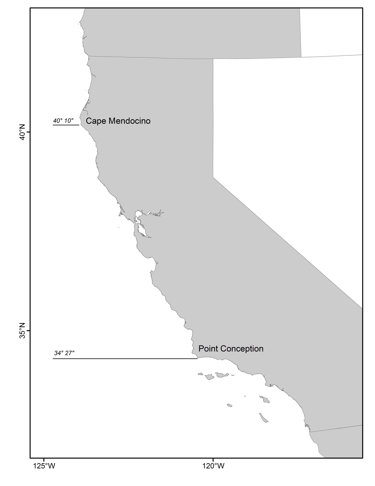

#Executive Summary{-}

##Stock{-}
This assessment reports the status of the gopher and black-and-yellow rockfish  
complex (GBYR, \emph{`r spp.sci`}) resource as in U.S. waters off the coast of the 
coast of California south of 
$40^\circ 10^\prime$ N. latitude (Cape Mendocino)  using data through `r LastYR`. 
Both gopher and black-and-yellow rockshes are most abundance north of Point Conception 
and are rare north of Sonoma. The range of gopher rockfish extends to Baja California, 
but the black-and-yellow rockfish are rare south of Point Conception.


##Catches{-}
Information on historical landings of `r spp` are available back to 1916
(Table \ref{tab:Exec_catch}). The recreational fleet bgan ramping up in the 1950s 
and has fluctuated over the the last 50 years (Figure \ref{fig:Exec_catch1}).  The majority of gopher and black-and-yellow rockfish recreational landings are from north of Point Conception. 

Commercial landings were small during 
the years of World War II, ranging between `r min(round(Tot.catch.df[Tot.catch.df[,1] >= 1939 & Tot.catch.df[,1] <= 1945,2],0))` to `r max(round(Tot.catch.df[Tot.catch.df[,1] >= 1939 & Tot.catch.df[,1] <= 1945,2],0))` metric  tons (mt) per year (Figure \ref{fig:Exec_catch2}. The commercial landings 
increased aftter World War II and show periods of cyclical catch for gopher and black-and-yellow 
rockfishes. The commercial live fish fishery began in the early 1990s, with the first reported 
live landings in 1993.  Since then the commercial catch has been dominated by the live fish fishery, 
with minimal landings of dead gopher or black-and-yellow rockfishes.  Esimates of total mortality of 
commercial discards was available starting in 2004, and were estimated prior to then. The landings 
aggregated by fleets modeled in this assessment can be found in Figure \ref{fig:r4ss_catches}.

Since 2000, annual total landings of `r spp` have ranged between 
`r paste0( min(round(Tot.catch.df[Tot.catch.df[,1] > 2000 & Tot.catch.df[,1] <= Dat_end_mod1,2],0)), '-', max(round(Tot.catch.df[Tot.catch.df[,1] > 2000 & Tot.catch.df[,1] <= Dat_end_mod1,2],0)) )` mt, with landings in `r Dat_end_mod1` totaling `r round(Tot.catch.df[Tot.catch.df[,1] == Dat_end_mod1,2],0)` mt.


\FloatBarrier

<!-- ***********BEGIN EXECUTIVE SUMMARY CATCH FIGURES AND TABLES*********** -->
<!-- ***********Edit the Plot_catch tables and captions******************** -->
<!-- ***********This depends on how many plots you need******************** -->
<!-- ***********Also included is the r4SS plot - keep or remove************ -->
<!-- ***********CATCH FIGURES********************************************** -->


```{r, include=F, fig.cap=paste('Stacked line plot of', spp, 'catch history from Pt. Conception to the U.S.-Mexico border and catches from Mexican waters. \\label{fig:Exec_catch3}',sep=' ')}
     # Plot California catches  
  #    Plot_catch(Catch_df = Exec_region3_catch)
```


\FloatBarrier


<!-- ***********CATCH TABLE************************************************ -->
```{r, results='asis'}
    #CSV: './txt_files/Exec_catch_summary.csv'
    # Catch table section in R_exec_summary_fig_tables.R
    # Print the table
    print(Exec_catch.table, include.rownames = FALSE, caption.placement = 'top')
```
<!-- ***********END EXECUTIVE SUMMARY CATCH FIGURES AND TABLES************* -->
\FloatBarrier

\newpage

##Data and Assessment{-}

This is the first full assessment to include data for black-and-yellow rockfish. 
Black-and-yellow rockfish was assessed coastwide as a data poor species using 
Depletion-Based Stock Reduction Analysis (DB-SRA) [@Dick2010]. The DB-SRA 
model assigned a 40% probability that the then recent (2008-2009) catch 
exceeded the 2010 OFL.

Gopher rockfish south of Point Conception was assessed as a data poor species in 2010 
[@Dick2010].  A Depletion-Corrected Average Catch (DCAC) model was used due to time 
constraints. The mean yield from the DCAC distribution was 25.5 mt.

Gopher rockfish north of Point Conception ($34^\circ 27^\prime$ N. latitude) 
was first assessed a full stock assessment in 2005 [@Key2005] using SS2 (version 1.19). 
The assessment was sensitive to the CPFV onboard observer index of abundance (referred 
to as Deb Wilson-Vandenberg's onboard observer index in this assessment). The final decision 
table was based around the emphasis given to the index, with a value of 5 given a 40% 
probability and used in the baseline model. The stock was found to be at 97% depletion. 

This assessment incorporates the area south of Point Conception, which was previously 
excluded from the 2005 assessment (Figure \ref{fig:assess_region_map}). 
The length composition data suggested that while 
the lengths of gopher and black-and-yellow rockfish were similar, fish encountered 
south of Point Conception were smaller.
The recreational catches from the man made mode are negligible and did not influence 
the decision to split the fleet at Point Conception. The similarity of the length 
distributions between species and among modes within a region were similar and justified 
one recreational fleet.

This stock assessment retains a single fleet for the commercial fishery, and also 
includes a commercial discard fleet.  Data on commercial discards were not available 
for and not included in the 2005 assessment.  The decision to retain one commercial 
fleet was made by examining the length distributions across species, fishing gears, 
and space, i.e., north and south of Point Conception. There is very little difference between 
the length composition of gopher and black-and-yellow rockfish landed in the commercial 
fleet north of Point Conception, which contributed 97% of the commercial landings 
from 1978-2018.  The length distributions suggest that gopher rockfish south of 
Point Conception landed dead south of Point Conception are slightly smaller 
on average than north of Point Conception.  However, there is not enough data 
available to justify splitting the commercial fishery north and south of Point 
Conception.  The length compositions of discarded fish are small in all of 
the subplots, suggesting size-based discarding.  Because Stock Synthesis is
not set up to handle depth-dependent discard mortality rates and we're modelling 
two species as a complex with differing depth-dependent discard mortality rates,
the time series of commercial discards was incorporated as a fleet.

A number of sources of uncertainty are now addressed in this assessment. This 
assessment includes length data, estimated growth, an updated length-weight curve, an
update maturity curve, a number of new indicies, and new conditional length at age data.  

 



\FloatBarrier

##Stock Biomass{-}
The predicted spawning biomass from the base model generally showed a slight decline prior 
to 1962, when the early recruitment deviations were first estimated (Figure \ref{fig:Spawnbio_all} 
and Table \ref{tab:SpawningDeplete_mod1}). The stock declined rom 1967 to 1995, followed by a period 
increase from 1996 to 2005. From 2005-2018 the stock has been in delcine, although leveled spawning 
biomass has been relatively level since 2017. The `r LastYR` estimated spawning biomass relative to unfished 
equilibrium spawning biomass is above the target of 40% of unfished spawning biomass at `r Depl_mod1` 
(95% asymptotic interval: $\pm$ `r Depl_mod1_CI`) (Figure \ref{fig:RelDeplete_all}). 
Approximate confidence intervals based on the asymptotic variance estimates show that the uncertainty 
in the estimated spawning biomass is high.
\FloatBarrier

<!--BEGIN  EXECUTIVE SUMMARY SPAWNING BIOMASS AND DEPLETE TABLES AND FIGURES-->
```{r, results='asis'}
    # Print spawning biomass table(s)
    print(Spawn_Deplete_mod1.table, include.rownames = FALSE, caption.placement = 'top')
    
    # Select which file to use for the recuitment figure, depending on if you have one model or multiple models
      spawn.file  = 'r4ss/plots_mod1/ts7_Spawning_output_with_95_asymptotic_intervals_intervals.png'
      Bratio.file = 'r4ss/plots_mod1/ts9_unfished_with_95_asymptotic_intervals_intervals.png'
```

\FloatBarrier


<!-- ***********END  EXECUTIVE SUMMARY SPAWNING BIOMASS AND**************** -->


<!-- ***********DEPLETION TABLES AND FIGURES******************************* -->

\FloatBarrier


##Recruitment{-}
Recruitment deviations were estimated from 1979-2018 (Figure \ref{fig:Recruits_all} and 
Table \ref{tab:Recruit_mod1}).  There are estimates of strong recuitment in the late 
1990s, and also from 2013-2015, which peaked in 2015. 


<!-- ***********BEGIN EXECUTIVE SUMMARY RECRUITMENT TABLES AND FIGURES***** -->
```{r, results='asis'}
   # Print recruitment tables; will print up to 3 depending on the number of models, you can delete the code
   # for models you don't need as well
   print(Recruit_mod1.table, include.rownames = FALSE, caption.placement = 'top')
   
   # select which file to use for the recuitment figure, depending on if you have one model or multiple models
   
     recruit.file  = 'r4ss/plots_mod1/ts11_Age-0_recruits_(1000s)_with_95_asymptotic_intervals.png'
    
```

\FloatBarrier


<!-- ***********END EXECUTIVE SUMMARY RECRUITMENT TABLEs AND FIGURES******* -->

 \FloatBarrier


##Exploitation status{-}
Harvest rates estimated by the base model exceeded management target levels 
 durin a number of years in the 1990s. (Table \ref{tab:SPR_Exploit_mod1} and 
 Figure \ref{fig:SPR_all}). Recent harvest over the last decade increased until 
 2016-2017 to 0.70 and decreased to 0.66 in 2018.  The estimated relative depletion 
 is currently greater than the 40% unfished spawning output target. Recent 
 exploitation rates on `r spp` were predicted to be significantly below target 
 levels.


\FloatBarrier

<!-- ***********BEGIN EXECUTIVE SUMMARY EXPLOITATION AND******************* -->
<!-- ***********SPRratio TABLE AND FIGURES********************************* -->
```{r, results='asis'}
   # Print exploitation and SPRratio tables depending on how many models there are
   
     print(SPRratio_Exploit_mod1.table, include.rownames = FALSE, caption.placement = 'top')
   
   # select the files for the SPR and phase plots depending on the number of models
   
     SPR.file   = 'r4ss/plots_mod1/SPR2_minusSPRseries.png'

   
```

\FloatBarrier


<!-- ************END EXECUTIVE SUMMARY EXPLOITATION************************ -->
<!-- ************AND SPRratio TABLE AND FIGURES**************************** -->

\FloatBarrier


##Ecosystem Considerations{-}
In this assessment, ecosystem considerations were not explicitly included in the analysis.  
This is primarily due to a lack of relevant data and results of analyses (conducted elsewhere) 
that could contribute ecosystem-related quantitative information for the assessment.


##Reference Points{-}

This stock assessment estimates that `r spp` in the `r mod1_label` is 
`r ifelse(Deplete_mod1[nrow(Deplete_mod1),2]-MT>0,"above","below")` the biomass 
target ($SB_{40\%}$), and well `r ifelse(Deplete_mod1[nrow(Deplete_mod1),2]-MSST>0,"above","below")` 
the minimum stock size threshold ($SB_{25\%}$). The estimated relative depletion level for the base 
model in `r LastYR+1` is 
`r Depl_mod1` (95% asymptotic interval: $\pm$ `r Depl_mod1_CI`, corresponding 
to an unfished spawning biomass of `r paste(Spawn_mod1, fecund_unit,sep=' ')` 
(95% asymptotic interval: `r paste(Spawn_mod1_CI, fecund_unit, sep=' ')`) of 
spawning biomass in the base model (Table \ref{tab:Ref_pts_mod1}).  Unfished 
age `r min_age` biomass was estimated to be `r Ref_pts_mod1[2,2]` mt in the 
base case model. The target spawning biomass ($SB_{40\%}$) 
is `r paste(Ref_pts_mod1[7,2], fecund_unit,sep=' ')`, which corresponds with an 
equilibrium yield of `r Ref_pts_mod1[10,2]` mt. Equilibrium yield at the proxy $F_{MSY}$ 
harvest rate corresponding to $SPR_{50\%}$ is `r Ref_pts_mod1[15,2]` mt (Figure \ref{fig:Yield_all}).


\FloatBarrier

<!-- ***********BEGIN EXECUTIVE SUMMARY REFERENCE POINT TABLES************* -->
```{r, results='asis'}
   # Print reference point tables
  
     print(Ref_pts_mod1.table, include.rownames = FALSE, caption.placement = 'top',
           sanitize.text.function = function(x){x})
   
```
<!-- ***********END EXECUTIVE SUMMARY REFERENCE POINT TABLES*************** --> 

\FloatBarrier


##Management Performance{-}

Gopher and black-and-yellow rockfishes are manage das part of the minor nearshore complex in 
the groundfish Fishery Management Plan.  The total mortality of the minor nearshore rockfish has been 
below the ACL in all years (2011-2016). Total mortality estiamtes from the NWFSC are not yet 
available are not yet available for 2017-2018. GBYR total mortality was on average 20% of the 
total minor nearshore rockfish total mortality from 2011-2016. A summary of these values 
as well as other base case summary results can be found in Table \ref{tab:mnmgt_perform}.


<!-- ***********BEGIN EXECUTIVE SUMMARY MANAGEMENT PERFORMANCE TABLE******* --> 
```{r, results='asis'}
    # Print management performance table - will have to edit the text file and 
    # R code for this table
    # Edit file: './txt_files/Exec_mngmt_performance.csv'
    print(mngmnt.table, add.to.row = a_header, 
          include.rownames = FALSE, caption.placement = 'top', 
          sanitize.text.function = function(x){x})
```
<!-- ***********END EXECUTIVE SUMMARY MANAGEMENT PERFORMANCE TABLE********* -->


##Unresolved Problems and Major Uncertainties{-}


\FloatBarrier


##Decision Table{-}    
This section will be completed after the STAR panel.

              


<!-- ***********BEGIN EXECUTIVE SUMMARY OFL AND DECISION TABLES************ -->
```{r, results='asis', include=FALSE}   
    # Print OFL table 
      print(OFL.table, include.rownames = FALSE, caption.placement = 'top')

   # Decision tables currently read in as txt files and will need to be changed
   # Decision table text set up for alternate states of natural mortality, but 
   # the text can be changed in the Decision Table section of the R file, 
   # R_exec_summary_figs_tables.R
   # Edit text file(s): ./txt_files/DecisionTable_mod1
    # print Model 1 decision table
    print(decision_mod1.table, add.to.row = addtorow, include.rownames = FALSE, 
          caption.placement = 'top', 
          hline.after = c(-1, 0, 10, 20, 30, nrow(decision_mod1.table)), 
          scalebox = .85)
```
<!-- ***********END EXECUTIVE SUMMARY OFL AND DECISION TABLES************** -->


<!-- ***********BEGIN EXECUTIVE SUMMARY RESULTS SUMMARY TABLE --> 
```{r, results='asis'}
   # Print the results summary table, will have to edit the R code and input file 
   # depending on the stock structure
   # Edit file: ./txt_files/Exec_basemodel_summary.csv and the Summary Results 
   # section in R code R_exec_summary_figs_tables.R
  
 print(base_summary.table, 
       include.rownames = FALSE, 
       caption.placement = 'top',
       floating.environment = 'sidewaystable', 
       sanitize.text.function = function(x){x}, 
       scalebox = .6, 
       align = TRUE, 
       hline.after = c(-1, 0, 4, 5, 7, 9, 11, nrow(base_summary.table)))
```


<!-- ***********END EXECUTIVE SUMMARY RESULTS SUMMARY TABLE AND YIELD CURVE -->

\FloatBarrier

\newpage

##Research and Data Needs{-}
This section will be completed after the STAR panel.

<!--
We recommend the following research be conducted before the next assessment:


\begin{enumerate}

\item \textbf{xxxx}: 

\item \textbf{xxxx}:

\item \textbf{xxxx}:

\item \textbf{xxxx}:

\item \textbf{xxxx}:

\end{enumerate}
->


\FloatBarrier

<!--************RESET FIGURE & TABLE NUMBERS FOR THE DOCUMENT'S MAIN BODY** -->
\newpage
\renewcommand{\thefigure}{\arabic{figure}}
\renewcommand{\thetable}{\arabic{table}}
\setcounter{figure}{0}
\setcounter{table}{0}