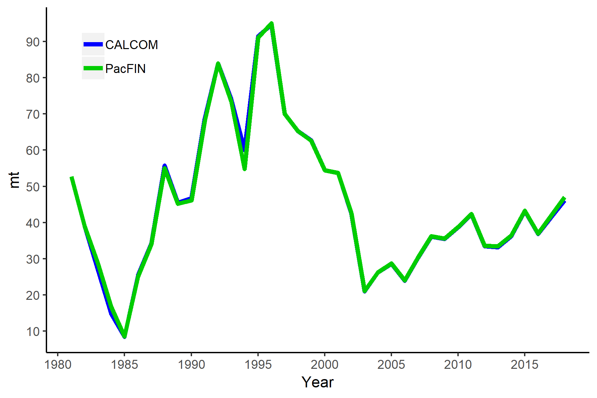
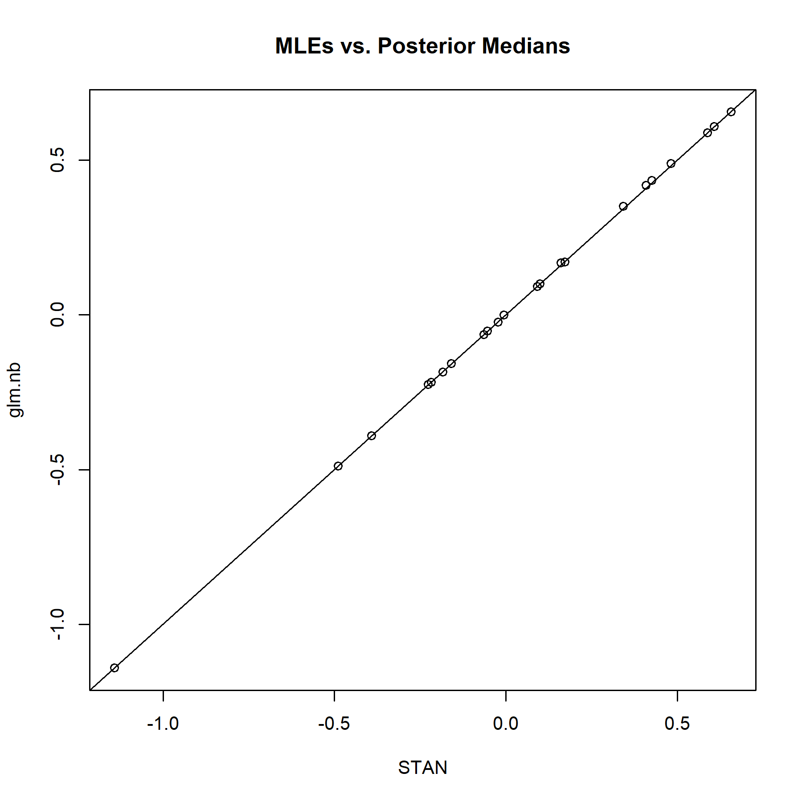

<!-- ====================================================================== -->
<!-- **************************             ******************************* --> 
<!-- **************************BEGIN FIGURES******************************* --> 
<!-- **************************             ******************************* -->
<!-- ====================================================================== -->
\FloatBarrier

\newpage

#Figures

<!-- ====================================================================== --> 
<!-- *********************INTRODUCTION FIGURES***************************** --> 
<!-- ====================================================================== --> 

<!-- ********************************************************************** --> 
<!-- *************************Data FIGURES********************************* --> 
<!-- ********************************************************************** -->

<!-- *************************Catches FIGURES********************************* -->

\FloatBarrier

<!-- ********************************************************************** -->
<!-- **************** Index FIGURES************************* -->
<!-- ********************************************************************** --> 

<!-- ********************************************************************** -->
<!-- ****************Fleet 10_11 Index FIGURES************************* -->
<!-- ********************************************************************** --> 

\FloatBarrier

\FloatBarrier
<!-- ********************************************************************** -->
<!-- ***************Fleet 5 Deb WV index FIGURES*********************--> 
<!-- ********************************************************************** -->

\FloatBarrier

<!-- ********************************************************************** -->
<!-- ***************Fleets 6 and 7 onboard index FIGURES********************--> 
<!-- ********************************************************************** -->

\FloatBarrier

<!-- ********************************************************************** -->
<!-- ***************Fleet 9 CCFRP index FIGURES********************--> 
<!-- ********************************************************************** -->

\FloatBarrier 

\FloatBarrier

\FloatBarrier

\FloatBarrier

<!-- ********************************************************************** -->
<!-- *************PISCO FIGURES******************** --> 
<!-- ********************************************************************** -->

\FloatBarrier

\FloatBarrier

\FloatBarrier

\FloatBarrier