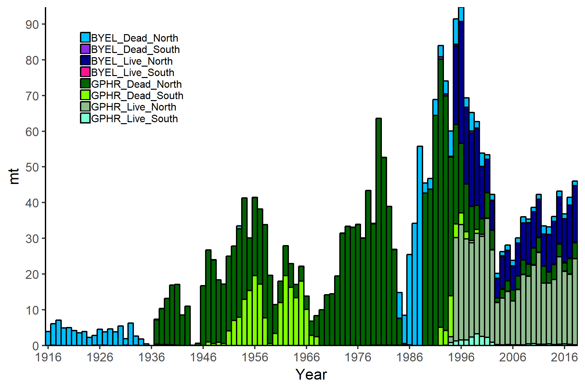

<!-- ====================================================================== -->
<!-- **************************             ******************************* --> 
<!-- **************************BEGIN FIGURES******************************* --> 
<!-- **************************             ******************************* -->
<!-- ====================================================================== -->
\FloatBarrier

\newpage

#Figures

<!-- ====================================================================== --> 
<!-- *********************INTRODUCTION FIGURES***************************** --> 
<!-- ====================================================================== --> 

<!-- ********************************************************************** --> 
<!-- *************************Data FIGURES********************************* --> 
<!-- ********************************************************************** -->

<!-- *************************Catches FIGURES********************************* -->

\FloatBarrier

<!-- ********************************************************************** -->
<!-- ****************Fleet xx Index FIGURES************************* -->
<!-- ********************************************************************** --> 

\FloatBarrier

\FloatBarrier
<!-- ********************************************************************** -->
<!-- ***************Fleet xx index FIGURES*********************--> 
<!-- ********************************************************************** -->

\FloatBarrier

\FloatBarrier

<!-- ********************************************************************** -->
<!-- ***************Fleet xx index FIGURES********************--> 
<!-- ********************************************************************** -->

\FloatBarrier

<!-- ********************************************************************** -->
<!-- *************Recreational onboard observer FIGURES******************** --> 
<!-- ********************************************************************** -->

\FloatBarrier

