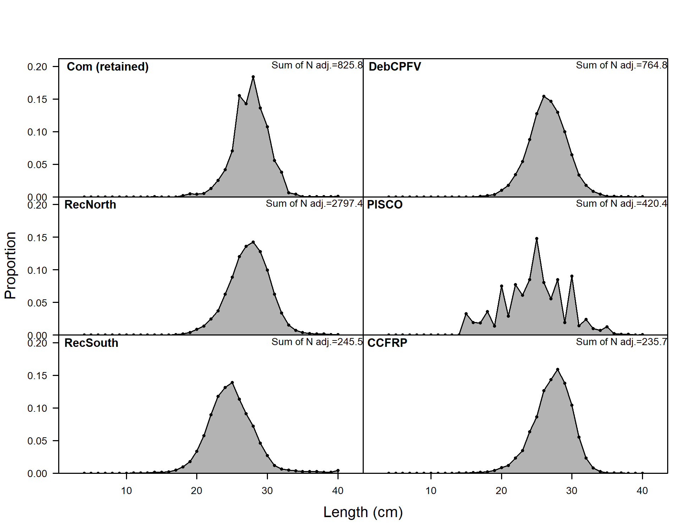
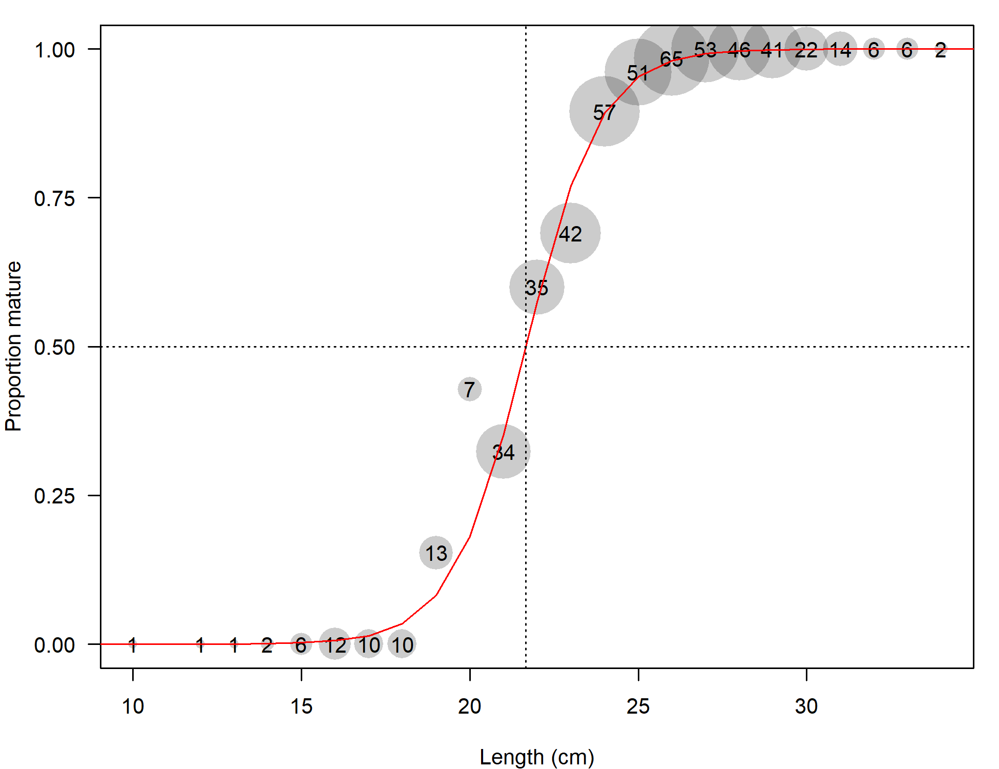

<!-- ====================================================================== -->
<!-- *****************                             ************************ -->
<!-- *****************START BIOLOGICAL DATA FIGURES************************ --> 
<!-- *****************                            ************************ -->
<!-- ====================================================================== -->

\FloatBarrier

\FloatBarrier

<!-- ********************************************************************** -->
<!-- ****************Aging Precision and Bias FIGURES********************** --> 
<!-- ********************************************************************** -->

\FloatBarrier

<!-- ********************************************************************** -->
<!-- **********************Weight-Length FIGURES*************************** --> 
<!-- ********************************************************************** -->

<!-- ********************************************************************** -->
<!-- **************Sex Ratio, Maturity, Fecundity FIGURES****************** --> 
<!-- ********************************************************************** -->

\FloatBarrier

<!-- ====================================================================== -->
<!-- ******************                           ************************* -->
<!-- ******************END BIOLOGICAL DATA FIGURES************************* --> 
<!-- ******************                           ************************* -->
<!-- ====================================================================== -->