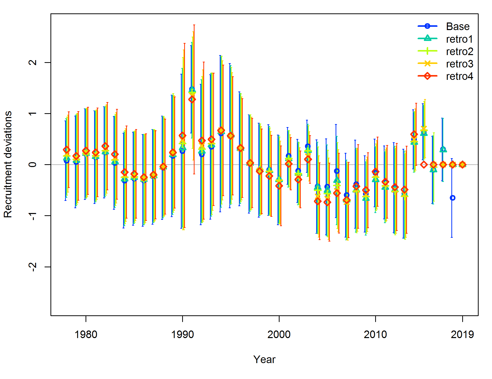
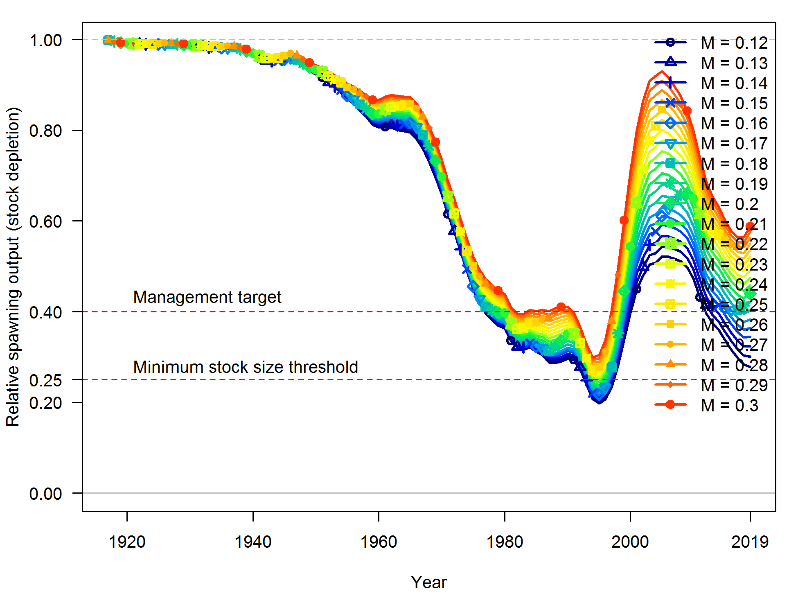

---
output:
  pdf_document: default
  html_document: default
---
<!-- ********************************************************************** -->
<!-- ***********FIGURES: Model results ********************************** --> 
<!-- ********************************************************************** -->

\FloatBarrier

<!-- ********************************************************************** -->
<!-- ****************Model description section FIGURES********************* --> 
<!-- ********************************************************************** -->
 


\FloatBarrier


\FloatBarrier


\FloatBarrier

<!-- ********************************************************************** -->
<!-- ***********History of modelleing approaches FIGURES******************* --> 
<!-- ********************************************************************** -->

<!-- ********************************************************************** -->
<!-- ****************Uncertainty and Sensitivity FIGURES******************* -->
<!-- ********************************************************************** -->

<!-- ***********MODEL 1 Uncertainty and Sensitivity FIGURES**************** --> 


\FloatBarrier


<!-- ********************************************************************** -->
<!-- *******************STAR PANEL Requests FIGURES************************ --> 
<!-- ********************************************************************** -->


\FloatBarrier


\FloatBarrier


\FloatBarrier


\FloatBarrier


\FloatBarrier


<!-- ====================================================================== -->
<!-- *********************BASE MODEL FIGURES******************************* -->
<!-- ====================================================================== -->

<!-- ***********COMPARE Pre- and Post-STAR model comparisons*************** --> 


\FloatBarrier


\FloatBarrier


<!-- ***********MODEL 1 BASE MODEL FIGURES********************************* --> 
 

\FloatBarrier


\FloatBarrier


\FloatBarrier


```{r, results='asis'}
   # select recruitment figure file - RMarkdown as of 2019 doesn't like these file names
     recruit.file  = 'r4ss/plots_mod1/ts11_Age-0_recruits_(1000s)_with_95_asymptotic_intervals.png'
```


\FloatBarrier 

<!-- ***********Fits to the data********************************* --> 


\FloatBarrier


\FloatBarrier 


\FloatBarrier


\FloatBarrier 


\FloatBarrier


\FloatBarrier 


\FloatBarrier

![Mean age for the recreational fishery (ages from north of Point Conception only) with 95% confidence intervals based on current samples sizes. Francis data weighting method TA1.8: thinner intervals (with capped ends) show result of further adjusting sample sizes based on suggested multiplier (with 95% interval) is `r paste0(round(Fweights[7,6],3), ' (',round(Fweights[7,9],3),'-', round(Fweights[7,10],3),')')`. For more info, see Francis et al. (2011). \label{fig:comp_condAALfit_data_weighting_TA1.8_condAgeRecNorth}](r4ss/plots_mod1/comp_condAALfit_data_weighting_TA1.8_condAgeRecNorth.png)


![Mean age for the CCFRP survey with 95% confidence intervals based on current samples sizes. Francis data weighting method TA1.8: thinner intervals (with capped ends) show result of further adjusting sample sizes based on suggested multiplier (with 95% interval) is `r paste0(round(Fweights[8,6],3), ' (',round(Fweights[8,9],3),'-', round(Fweights[8,10],3),')')`. For more info, see Francis et al. (2011). \label{fig:comp_condAALfit_data_weighting_TA1.8_condAgeCCFRP}](r4ss/plots_mod1/comp_condAALfit_data_weighting_TA1.8_condAgeCCFRP.png)


![Mean age for the 'dummy' fleet with 95% confidence intervals based on current samples sizes. Francis data weighting method TA1.8: thinner intervals (with capped ends) show result of further adjusting sample sizes based on suggested multiplier (with 95% interval) is `r paste0(round(Fweights[9,6],3), ' (',round(Fweights[9,9],3),'-', round(Fweights[9,10],3),')')`. For more info, see Francis et al. (2011). \label{fig:comp_condAALfit_data_weighting_TA1.8_condAgeDummy1}](r4ss/plots_mod1/comp_condAALfit_data_weighting_TA1.8_condAgeDummy1.png)


\FloatBarrier


<!-- ********************************************************************** -->
<!-- *****************Retrospective analysis FIGURES*********************** -->
<!-- ********************************************************************** -->

<!-- ***********MODEL 1 Retrospective analysis FIGURE********************** --> 


\FloatBarrier




\FloatBarrier

<!-- ********************************************************************** -->
<!-- ******************Likelihood profile FIGURES************************** --> 
<!-- ********************************************************************** -->

<!-- ***********R0 Likelihood profile FIGURES****************************** --> 


\FloatBarrier


\FloatBarrier


\FloatBarrier

<!-- ***********h Likelihood profile FIGURES******************************* -->


\FloatBarrier 


\FloatBarrier


\FloatBarrier


\FloatBarrier


<!-- ***********M Likelihood profile FIGURES******************************* -->

\FloatBarrier 


\FloatBarrier


\FloatBarrier 


\FloatBarrier



\FloatBarrier

<!-- ***********k Likelihood profile FIGURES******************************* -->


\FloatBarrier 


\FloatBarrier 


\FloatBarrier


<!-- ********************************************************************** -->
<!-- *********************REFERENCE POINTS FIGURES************************* --> 
<!-- ********************************************************************** -->

<!-- ***********MODEL 1 REFERENCE POINTS FIGURES*************************** --> 


```{r, results='asis'}
   # select recruitment figure file - RMarkdown as of 2019 doesn't like these file names
     depletion.file  = 'r4ss/plots_mod1/ts9_Fraction_of_unfished_with_95_asymptotic_intervals_intervals.png'
```


\FloatBarrier

<!-- ********************************************************************** --> 
<!-- *************************FORECAST FIGURES***************************** --> 
<!-- ********************************************************************** --> 
