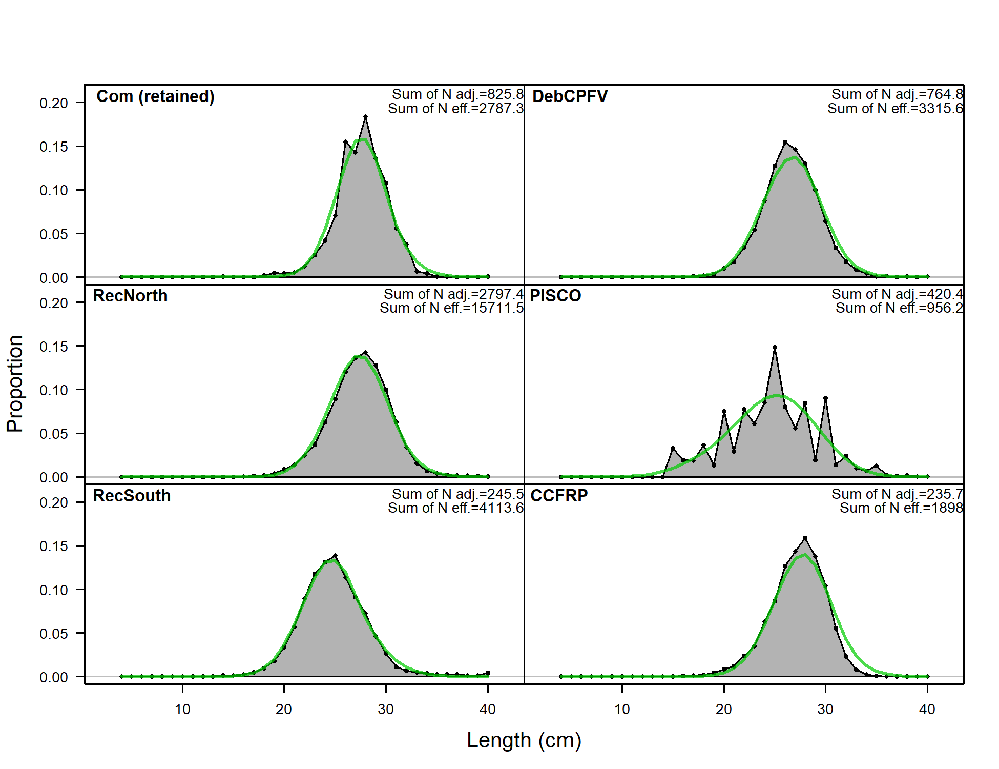

```{r global_options, include=FALSE}
    # set global options for R code chunks: echo=FALSE (don't include source code); 
    # warning=FALSE (suppress R warnings); message=FALSE (suppress R messages)
    # eval = TRUE is default
    knitr::opts_chunk$set(echo = FALSE, warning = FALSE, message = FALSE)
    library(knitr)
    library(xtable)
    # Change options  
      options(xtable.comment = FALSE)  # turns off xtable comments
      options(scipen=999)              # turns off scientific notation

    # Read in preamble R code - including required libraries and the SS file(s)
    source('./Rcode/Preamble.R')
 
    # Read in data/manipulations for executive summary tables and figures
    # It may take time to edit this file and get it ready for your assessment
    # Make small changes in this file and then try to compile the document
    # Commit when you have a success!
    source('./Rcode/Exec_summary_figs_tables.R')
      
    cat(knit_child(text=readLines('8_Tables.Rmd')), sep = '\n')
    cat(knit_child(text=readLines('8a_Tables.Rmd')), sep = '\n')
```

<!--------------------------------------------------------------------------------->
#Background
<!--------------------------------------------------------------------------------->
##California scorpionfish (*Scorpaena guttata*)


\begin{itemize} 
 \item[$\bullet$] Most common species of \emph{Scorpaena} on the U.S. West Coast, more species in Mexico
 \item[$\bullet$] Venomous dorsal, anal and pelvic spines
 \item[$\bullet$] Demersal, found over both hard and soft bottom (anectodtal evidence sugggests they prefer \emph{new} structure)
 \item[$\bullet$] Exhibit aggregating behavior (spawning and non-spawning aggregations)  
\end{itemize}

\centering
\includegraphics[width=.5\textwidth]{cover_photo}

##Early Life History

\begin{itemize} 
\item[$\bullet$] Migration to spawning grounds, exhibit explosive breeding behavior just before dawn
\item[$\bullet$] External fertilization, females produce hollow gelatenous single-layer floating egg matrix
\item[$\bullet$] Eggs hatch after about 5 days
\item[$\bullet$] Juveniles settle at less than 2 cm 
\end{itemize}

\centering
\includegraphics[width=.5\textwidth]{Figures/baby_scorp}

\footnotetext{Line drawning from CalCOFI Atlas 33, pg. 789 Figure 26}


##Distribution

\begin{itemize} 
 \item[$\bullet$] Distributed from central California to Punta Eugenia, Baja California Sur, Mexico 
 \item[$\bullet$] Rarely observed north of Pt. Conception  
 \item[$\bullet$] Observed from the intertidal to 600 ft,  prefer depths of 20-450 ft  
 \item[$\bullet$] Proportion of the stock in Mexican waters unknown
\end{itemize}

##Distribution and Stock Assessment Boundary
\begincols
  \begincol{.5\textwidth}


  \endcol
  \begincol{.5\textwidth}
  
  \endcol
\endcols

##2005 Stock Assessment

\begin{itemize}
\item[$\bullet$] Stock first assessed in 2005
\item[$\bullet$] South of Pt. Conception
\item[$\bullet$] $M$ fixed at 0.25
\item[$\bullet$] $h$ fixed at 0.7
\item[$\bullet$] Publicly Owned Treatment Works (POTW) monitoring trawl survey was the axis of uncertainty in the 2005 assessment
\begin{itemize}
\item[$\circ$] POTW survey referred to as the Sanitation District Index in 2005
\end{itemize}
\end{itemize}


##2005 Stock Assessment

\begin{itemize}
\item[$\bullet$] Transitioning from the 2005 assessment, an error was found
\item[$\bullet$] Harvest rate hit the bounds for the recreational fleet
\item[$\bullet$] Not all of the recreational catch was removed in the model
\item[$\bullet$] Input vs. estimated catch was not standard output in SS v.1.8
\end{itemize}


\begincols
  \begincol{.5\textwidth}
  
  
  
  \endcol
  \begincol{.5\textwidth}
   
  
  
  \endcol
\endcols


##2005 Stock Assessment

\begincols
  \begincol{.5\textwidth}

\begin{itemize}
\item[$\bullet$] \textcolor{blue}{2005 assessment, SS v.1.8}
\item[$\bullet$] \textcolor{red}{2005 model in SS3.24z}
\item[$\bullet$] \textcolor{violet}{2017 pre-STAR base model, SS3.30.0.05}
\item[$\bullet$] The two assessments have very similar trends over time, with $B_0$ higher for the 2017 assessment that includes all removals
\end{itemize}

  \endcol
  \begincol{.5\textwidth}
  

  
  \endcol
\endcols


##2017 Stock Assessment
Pre-STAR Base Model

\begin{itemize}
\item[$\bullet$] One area south of Pt. Conception 
\begin{itemize}
\item[$\circ$] Catches from Mexican waters excluded as in 2005
\end{itemize}
\item[$\bullet$] Steepness fixed at 0.718
\item[$\bullet$] Sex-specific $M$ fixed for females, male $M$ estimated as offset
\item[$\bullet$] Re-evaluated fleet definitions
\item[$\bullet$] Ages now available from the NWFSC trawl survey
\item[$\bullet$] New indices and length compositions available
\item[$\bullet$] Newest version of SS allows specification of the minimmum sample size
\end{itemize}


<!--------------------------------------------------------------------------------->
#Catch
<!--------------------------------------------------------------------------------->
##Catches by Fleet
\centering


##Regulations
  \textbf{Recreational} 
  \begin{itemize}
  \item[\textbf{2000}] 10-in min. size limit, 3 hooks and 1 line   
  \item[\textbf{2001}] 2 hooks and 1 line, Cowcod conservation area  
  \item[\textbf{2002}] Various season length restrictions  
  \item[\textbf{2003}] 20-30 fm depth restriction in 2003, otherwise post-2001 unrestricted or 50 or 60 fm, 5 fish bag limit  
  \end{itemize}
  
\textbf{Commercial}  
    \begin{itemize}
  \item[\textbf{1999}] 10-in min. size limit, Nearshore fishery permit with restricted access at 1100 permits
  \item[\textbf{3003}]  Nearshore fishery permit with restricted access at 200 permits
  \end{itemize}

##Regulations - depth and closures
Commercial (left) and Recreational (right)
  \begincols
  \begincol{.4\textwidth}
   \includegraphics{Figures/Com_regs.png}
\endcol
  \begincol{.6\textwidth}
     \includegraphics{Figures/Rec_regs.pdf}  
    \endcol
\endcols


##U.S. and Mexico Catch 


##Recreational Catch
\begincols
  \begincol{.4\textwidth}

\begin{itemize}
\item[$\bullet$] 2005 assessment used number of fish for recreational catches
\item[$\bullet$] 2017 assessment includes one recreational discard fleet
\begin{itemize}
\item[$\circ$] Discard mortality rate of 7\%
\item[$\circ$] Discard biomass accounts for  $<$3\% of recreational mortality
\end{itemize}
\end{itemize}

\endcol
  \begincol{.6\textwidth}
\includegraphics[totalheight=0.65\textheight]{California_scorpionfish_2017_files/figure-latex/unnamed-chunk-16-1.pdf}  
  \endcol
\endcols

##Commercial Catch
\begincols
  \begincol{.4\textwidth}
 \begin{itemize}
  \item[$\bullet$] Historical catches same as the 2005 assessment
  \item[$\bullet$] California Fisheries Information System (CFIS) landings data used to update catches from 2005-2016 
  \item[$\bullet$] Discards assumed neglible
\end{itemize}
   \endcol
  \begincol{.55\textwidth}

  \endcol
\endcols


<!--------------------------------------------------------------------------------->
#Indices
<!--------------------------------------------------------------------------------->
##Indices of Abundance


##Indices of Abundance
- All of the methods used to standardize indices have been endorsed by the SSC

```{r, results = 'asis'}
    # Years read in as factor - change to shorten.
      Index_summary$Years = as.character(Index_summary$Years)
      Index_summary[7,2] = paste0("'94, '98, '03, '08, '13")
      Index_summary = Index_summary[,c(3,2,4,6)]

    # Print index summary table
      print(xtable(Index_summary,
                   align = 'lp{2.5in}p{0.8in}p{.4in}p{2in}'),
            include.rownames=FALSE,
            scalebox = 0.7,
            sanitize.text.function = function(x){x})
```
<!--
##Fishery-Dependent Abundance Indices
\begin{itemize}
\item[$\bullet$] CDFW dockside intercept survey of retained catch
\begin{itemize}
\item[$\circ$] Private/rental fleet
\item[$\circ$] Party/charter fleet (developed and not used in base model)
\end{itemize}
\item[$\bullet$] Commercial Passenger Fishing Vessel (CPFV) logbooks 
\item[$\bullet$] CDFW onbord observer survey of the CPFV fleet
\begin{itemize}
\item[$\cdot$] Developed separate indices for retained and discarded catch 
\end{itemize}
\end{itemize}
-->

##Indices of Abundance

__Delta-GLM Approach__

\begin{itemize}
\item[$\bullet$] Approach used for all indices excpet the NWFSC trawl survey and the CPFV logbook 
\item[$\bullet$] Two-part model
\begin{itemize}
\item[$\circ$] Binomial for to the presence-absence data
\item[$\circ$] Lognormal of Gamma fit to positives
\end{itemize}
\item[$\bullet$] General approach 
\begin{itemize}
\item[$\circ$] Filter data to identify most appropriate samples 
\item[$\circ$] Model selection
\begin{itemize}
\item[$\cdot$] Gamma or Lognormal for positives
\item[$\cdot$] Covariates for each of the two models chosen using AIC
\end{itemize}
\end{itemize}
\item[$\circ$] Uncertainty for final model estimated via jackknifing 
\end{itemize}


<!--------------------------------------------------------------------------------->
##Recreational Dockside Private Boat Index
<!--------------------------------------------------------------------------------->

__Sample__: California CRFS only; __Years__: 2006-2016; __Effort__: Angler days 

\begincols
  \begincol{.6\textwidth}

```{r, results='asis'}
Fleet4_filter1 = Fleet4_filter
colnames(Fleet4_filter1) = c('Filter','Criteria','Pos. Trips','Trips')
print(xtable(Fleet4_filter1,
             align = 'lp{1.4in}p{2in}p{.5in}p{.5in}'), 
      include.rownames=FALSE,
      sanitize.text.function = function(x){x},
      scalebox=0.5)
```

  \endcol
  \begincol{.4\textwidth}


```{r, results='asis'}
   #Fleet 4 aic
     print(xtable(Fleet4_aic,
                  align = 'lp{1.8in}p{.5in}p{.5in}'), 
              include.rownames=FALSE,
              sanitize.text.function = function(x){x},
              scalebox=0.55)
```

\includegraphics[height=5cm]{Figures/Fleet4_RecPR_dockside_QQ.png}

  \endcol
\endcols


##Recreational Dockside Private Boat Index

\begincols
  \begincol{.5\textwidth}
\begin{itemize}
\item[$\bullet$] Positive indicators: treefish, barred sandbass, ocean whitefish, cabezon
\item[$\bullet$] Negative indicators: yellowtail amberjack, bat rays, white croaker, white seabass
\item[$\bullet$] Similar indicator species as in the MRFSS party/charter analysis
\end{itemize}

  \endcol
  \begincol{.5\textwidth}
  
\centering
\includegraphics[height=8cm]{Figures/Fleet4_RecPR_SMcoef.png}

  \endcol
\endcols

##Recreational Dockside Private Boat Index
__Results__

\centering


<!--------------------------------------------------------------------------------->
##Recreational CPFV Logbook Index
<!--------------------------------------------------------------------------------->
__Sample__: Captain-reported catch; __Years__: 1980-2016; __Effort__: Angler hours

```{r, results='asis'}
Fleet5_filter1 = Fleet5_filter
colnames(Fleet5_filter1) = c('Filter','Criteria','Trips')
print(xtable(Fleet5_filter1,
             align = 'lp{2.4in}p{2.6in}p{.6in}'), 
      include.rownames=FALSE,
      sanitize.text.function = function(x){x},
      scalebox=0.5)
```


##Recreational CPFV Logbook Index
__Results__

\begincols
  \begincol{.4\textwidth}
```{r, results='asis'}
   #Fleet 5 aic
     print(xtable(Fleet5_aic,
                  align = 'lp{1.6in}p{1.5in}'), 
              include.rownames=FALSE,
              sanitize.text.function = function(x){x},
              scalebox=0.6)
```

  \endcol
  \begincol{.6\textwidth}

\includegraphics{r4ss/plots_mod1/index4_logcpuedata_RecPC.png}
  \endcol
\endcols

<!--------------------------------------------------------------------------------->
##Recreational Dockside Party/Charer Boat Index
<!--------------------------------------------------------------------------------->

__Sample__: California MRFSS ; __Years__: 1980-2003; __Effort__: Angler hours 

\begincols
  \begincol{.5\textwidth}
  
\begin{itemize}
\item[$\bullet$] \emph{Index not used in the assessment}
\item[$\bullet$] No MRFSS sampling from 1990-1992
\item[$\bullet$] Index sensitive to Stephens-MacCall threshold
\item[$\bullet$] Dockside index estimate for 1989 is high and anomolous
\item[$\bullet$] Data redundant with the CPFV logbook index
\item[$\bullet$] 1989 estimate lower if a higher threshold is used
\end{itemize}

  \endcol
  \begincol{.5\textwidth}


  \endcol
\endcols

<!--------------------------------------------------------------------------------->
##Recreational Onboard Indices
<!--------------------------------------------------------------------------------->
__Sample__: Drift-level catch  __Years__: 1999-2016 __Effort__: Angler hours 

\begincols
  \begincol{.4\textwidth}
  
  \begin{itemize}
  \item[$\bullet$] Drift-level catch data collection onboard CPFVs
  \item[$\bullet$] Alpha hull method used to select suitable habitat for California scorpionfish
  \item[$\bullet$] Assume that suitable habitat is the same for discarded and retained fish
  \end{itemize} 

  \endcol
  \begincol{.6\textwidth}
  
```{r, results='asis'}
Fleet6_filter1 = Fleet6_filter
colnames(Fleet6_filter1) = c('Filter','Criteria','Pos. trips','Trips')
print(xtable(Fleet6_filter1,
             align = 'lp{1.4in}p{2in}p{.6in}p{.6in}'), 
      include.rownames=FALSE,
      sanitize.text.function = function(x){x},
      scalebox=0.5)
```  
    \endcol
\endcols

##Recreational Onboard Indices
\vspace{1cm}

\begincols
  \begincol{.5\textwidth}
Discarded Catch
```{r, results='asis'}
   #Fleet 6 aic
     print(xtable(Fleet6_aic,
                  align = 'lp{2in}p{.6in}p{.6in}'), 
              include.rownames=FALSE,
              sanitize.text.function = function(x){x},
              scalebox=0.6)
```
\includegraphics[height=4cm]{Figures/Fleet6_RecDD_QQ.png}

  \endcol
  \begincol{.5\textwidth}
  
Retained Catch
```{r, results='asis'}
   #Fleet 12 aic
     print(xtable(Fleet12_aic,
                  align = 'lp{2in}p{.6in}p{.6in}'), 
              include.rownames=FALSE,
              sanitize.text.function = function(x){x},
              scalebox=0.6)
```

\includegraphics[height=4cm]{Figures/Fleet12_RecPCOB_QQ.png}
  \endcol
\endcols


##Recreational Onboard Indices
\begincols
  \begincol{.5\textwidth}
  Discard catch index (left)


  \endcol
  \begincol{.5\textwidth}
 Retained catch index (right)
  
  \endcol
\endcols

##Recreational Onboard Indices
\includegraphics{Figures/Fleets6_12_index_compare.png}

<!--------------------------------------------------------------------------------->
##Fishery-Independent Abundance Indices
<!--------------------------------------------------------------------------------->
\begin{itemize}
\item[$\bullet$] Publicly Owned Treatment Works (POTW) Monitoring Index
\item[$\bullet$] NWFSC Trawl Survey 
\item[$\bullet$] California State Univeristy Northridge/Vantuna Research Group (CSUN/VRG) Gillnet Survey
\item[$\bullet$] Generating Station Impingement Survey
\item[$\bullet$] Southern California Bight Regional Monitoring Survey (Bight survey)
\end{itemize}


<!--------------------------------------------------------------------------------->
##Publicly Owned Treatment Works Survey Index
<!--------------------------------------------------------------------------------->
\begin{itemize}
\item[$\bullet$] Publicly Owned Treatment Works (POTWs) are required to have permits to discharge into state or federal waters
\item[$\bullet$] Six southern California POTWs conduct trawls to monitoring fish populations (Goleta and City of Oxnard do not observer California scorpionfish)
\begin{itemize}
\item[$\circ$] Each POTW follows standardized trawl methods
\item[$\circ$] Fixed station design, sample spring and fall, or more frequently
\item[$\circ$] All fish encountered are measured, standard length
\end{itemize}
\item[$\bullet$]  Four POTWs observed California scorpionfish
\begin{itemize}
\item[$\circ$] Orange County Sanitation District (1970-2016)
\item[$\circ$] City of Los Angeles Environmental Monitoring Division (1988-2016)
\item[$\circ$] Sanitation Districts of Los Angeles County (1972-2016)
\item[$\circ$] City of San Diego Public Utilities Department (1985-2016)
\end{itemize}
\end{itemize}


##POTW Survey Index
\begincols
  \begincol{.5\textwidth}
  \centering

  \endcol
  \begincol{.5\textwidth}
  \centering

  \endcol
\endcols

##Publicly Owned Treatment Works Survey Index
__Sample__: Four POTWs  __Years__: 1970-2016 __Effort__: Tow time

Number of California scorpionfish encountered by POTW and 25 m depth bin

```{r, results='asis'}
  print(xtable(Fleet7_lengthdepth),
                include.rownames=FALSE,
                scalebox = 0.9,
                sanitize.text.function = function(x){x})
```
##Publicly Owned Treatment Works Survey Index

__Results__

\begincols
  \begincol{.4\textwidth}
  
  \endcol
  \begincol{.6\textwidth}

  
  \endcol
\endcols

<!--------------------------------------------------------------------------------->
##Gillnet Survey Index
<!--------------------------------------------------------------------------------->
__Sample__: CSUN/VRG survey  __Years__: 1995-2008 __Effort__: Soak time 

\begincols
  \begincol{.6\textwidth}
```{r results='asis'}
Fleet9_filter1 = Fleet9_filter
colnames(Fleet9_filter1) = c('Filter','Criteria','Pos. trips','Trips')
 print(xtable(Fleet9_filter1,
              align = 'lp{1.4in}p{2in}p{.6in}p{.6in}'), 
              include.rownames=FALSE, 
              sanitize.text.function = function(x){x},
              scalebox=.5)
```

```{r results='asis'}
 print(xtable(Fleet9_aic,
              align = 'lp{3in}p{.6in}p{.6in}'), 
      include.rownames=FALSE, 
      sanitize.text.function = function(x){x},
      scalebox=0.5)
```

  \endcol
  \begincol{.4\textwidth}


\includegraphics[height=5cm]{Figures/Fleet9_GillnetSurvey_QQ.png}

  \endcol
\endcols

##Gillnet Survey Index


<!--------------------------------------------------------------------------------->
##Southern California Bight Trawl Survey Index
<!--------------------------------------------------------------------------------->
__Sample__: Bight Trawl Survey  __Years__: 1994, 1998, 2003, 2008, 2013 __Effort__: Tow time 

\includegraphics[height=7cm]{Figures/Fleet11_SCBSurvey_map.pdf}


##Southern California Bight Trawl Survey Index
\begincols
  \begincol{.6\textwidth}
```{r results='asis'}
Fleet11_filter1 = Fleet11_filter
colnames(Fleet11_filter1) = c('Filter','Criteria','Pos. trips','Trips')
 print(xtable(Fleet11_filter1,
              align = 'lp{.8in}p{2in}p{.6in}p{.6in}'), 
              include.rownames=FALSE, 
              sanitize.text.function = function(x){x},
              scalebox=.5)
```


```{r results='asis'}
 print(xtable(Fleet11_aic,
              align = 'lp{2in}p{.6in}p{.6in}'), 
      include.rownames=FALSE, 
      sanitize.text.function = function(x){x},
      scalebox=0.5)
```

  \endcol
  \begincol{.4\textwidth}
  
\includegraphics[height=4cm]{Figures/Fleet11_SCBsurvey_QQ.png}
  \endcol
\endcols


##Southern California Bight Trawl Survey Index

__Results__  
\centering


<!--------------------------------------------------------------------------------->
##NWFSC Trawl Survey Index
<!--------------------------------------------------------------------------------->
Geostatistical approach Vector Autoregressive Spatio-Temporal (VAST) model

\begin{itemize}
\item[$\bullet$] Uses delta-GLMM framework
\begin{itemize}
\item[$\circ$] Probability of encounters
\item[$\circ$] Catch rates for non-zero catches
\end{itemize}
\item[$\bullet$] Geostatistical approach
\begin{itemize}
\item[$\circ$] Divides survey area into fine-scale grids
\item[$\circ$] Assumes that nearby grids have more similar fish density than those further away
\item[$\circ$] Smooths density estimates over the landscape
\item[$\circ$] Reduces uncertainty in the estimates
\end{itemize}
\end{itemize}

##NWFSC Trawl Survey Index

__Sample__: California MRFSS and CRFS  __Years__: 1980-2003 __Effort__: Angler hours 

\includegraphics[height=.7\textheight]{Figures/NWFSCtrawl_map.png}


##NWFSC Trawl Survey Index
Proportion of positive tows and raw catch rate by depth (left) and latitude (right)
\begincols
  \begincol{.5\textwidth}
\centering


  \endcol
  \begincol{.5\textwidth}


  \endcol
\endcols

##NWFSC Trawl Survey Index

Comparison of length data by sex and depth (left) and latitude (right)
\begincols
  \begincol{.5\textwidth}


  \endcol
  \begincol{.5\textwidth}


  
  \endcol
\endcols


##NWFSC Trawl Survey Index

\begincols
  \begincol{.5\textwidth}
\includegraphics[height=4cm]{Figures/Fleet8_NWFSCtrawl_CompareVAST.png}
  \endcol
  \begincol{.5\textwidth}
\includegraphics[height=4cm]{Figures/NWFSCtrawl_QQ.jpg}

  \endcol
\endcols

##NWFSC Trawl Survey Index

__Comparison with the GLMM__


##NWFSC Trawl Survey Index
\centering
\includegraphics{r4ss/plots_mod1/index4_logcpuedata_NWFSCtrawl.png}


<!--------------------------------------------------------------------------------->
#Composition
<!--------------------------------------------------------------------------------->
##Length compositions were provided from the following sources:

\begin{itemize}
  \item[$\bullet$] CDFW market category study (\emph{commercial dead fish}, 1996-2003)    
  \item[$\bullet$] CALCOM (\emph{commercial dead fish}, 2013-2016)    
  \item[$\bullet$] CDFW onboard observer (\emph{recreational charter discards}, 2003-2016)  
  \item[$\bullet$] Collins and Crooke onboard observer surveys (1975-1978) 
  \item[$\bullet$] Ally onboard observer study (\emph{recreational charter kept/discards}, 1984-1989)  
  \item[$\bullet$] MRFSS (1980-2003) and CRFS (2004-2014) (\emph{private and party/charter, kept})
  \item[$\bullet$] POTW trawl surveys (\emph{research}, 1970-2016)      
  \item[$\bullet$] CSUN/VRG gillnet survey (\emph{research}, 1995-2008)        
  \item[$\bullet$] Power plant impingement surveys (\emph{research}, 1974-2016)  
  \item[$\bullet$] Southern California Bight trawl survey (\emph{research}, 1994, 1998, 2003, 2008, 2013) 
\end{itemize}

##Aggregate length composition



##Commercial fishery length composition
\begincols
  \begincol{.5\textwidth}
  \centering
  Commercial hook-and-line
\includegraphics[height=3cm]{r4ss/plots_mod1/comp_lendat_bubflt1mkt2.png}

Commercial gillnet
\includegraphics[height=3cm]{r4ss/plots_mod1/comp_lendat_bubflt2mkt2.png}
  \endcol
  \begincol{.5\textwidth}
  \centering
  Commercial trawl
\includegraphics[height=4cm]{r4ss/plots_mod1/comp_lendat_bubflt3mkt2.png}
  \endcol
\endcols


##Recreational fishery Length Composition
\begincols
  \begincol{.5\textwidth}
  Recreational private fleet
\includegraphics[height=3cm]{r4ss/plots_mod1/comp_lendat_bubflt4mkt2.png}

Recreational party/charter fleet
\includegraphics[height=3cm]{r4ss/plots_mod1/comp_lendat_bubflt5mkt2_page2.png}
  \endcol
  \begincol{.5\textwidth}
  \centering
  
  Recreational dead discards
\includegraphics[height=4cm]{r4ss/plots_mod1/comp_lendat_bubflt6mkt2.png}
  \endcol
\endcols

##Research Length Composition

\begincols
  \begincol{.5\textwidth}
  POTW survey
\includegraphics[height=3cm]{r4ss/plots_mod1/comp_lendat_bubflt7mkt2_page2.png}

Gillnet survey
\includegraphics[height=3cm]{r4ss/plots_mod1/comp_lendat_bubflt9mkt2.png}
  \endcol
  \begincol{.5\textwidth}
Impingement survey
\includegraphics[height=3cm]{r4ss/plots_mod1/comp_lendat_bubflt10mkt2.png}

Bight trawl survey
\includegraphics[height=3cm]{r4ss/plots_mod1/comp_lendat_bubflt11mkt2.png}
  \endcol
\endcols

##NWFSC Length and Age Composition
Note: females in red and males in blue
\begincols
  \begincol{.5\textwidth}
\includegraphics[height=.5\textheight]{r4ss/plots_mod1/comp_condAALdat_bubflt8mkt0_page1.png}
  \endcol
  \begincol{.5\textwidth}
\includegraphics[height=.5\textheight]{r4ss/plots_mod1/comp_condAALdat_bubflt8mkt0_page2.png}
  \endcol
\endcols

<!--------------------------------------------------------------------------------->
#Biological
<!--------------------------------------------------------------------------------->
##Length data
\begin{itemize}
\item[$\bullet$] 2005 assessment used standard length
\item[$\bullet$] Impingement, POTW, and Bight surveys measure standard length
\item[$\bullet$] 2017 assessment uses total length (conversion based on a CDFW halibut trawl study; measured both SL and TL)
\item[$\bullet$] To avoid gaps in TL length bins, TL = SL - 0.5 + U[0,1] 
\end{itemize}

\includegraphics[height=.5\textheight]{Figures/SL_to_TL_compare.png}

##Length data
POTW lengths
\begincols
  \begincol{.4\textwidth}
\includegraphics{Figures/Fleet7_Sanitation_lengthboxplots.png}
  \endcol
  \begincol{.6\textwidth}
\includegraphics{Figures/Fleet7_Sanitation_length_source.png}  
  \endcol
\endcols


##Length-at-Age

\begincols
  \begincol{.4\textwidth}
    \includegraphics[trim={0 0 0 2cm}, totalheight=0.65\textheight]{Figures/Age_length_bySex.png}
  \endcol
  \begincol{.48\textwidth}

   \endcol
\endcols


##Length-at-Age

\begincols
  \begincol{.4\textwidth}
  
\endcol
\begincol{.48\textwidth}
  
 \endcol
\endcols
 
##Maturity and Fecundity
\begincols
  \begincol{.5\textwidth}
\begin{itemize}
\item[$\bullet$] Only information on maturity from Love et al. (1987)
\item[$\bullet$] Found over 50\% of females were mature by 18 cm TL, or two years of age. 
\item[$\bullet$] All fish were mature by 22 cm TL
\item[$\bullet$] No information available on fecundity of California scorpionfish
\end{itemize}
  \endcol
  \begincol{.5\textwidth}
\includegraphics[height=5cm]{r4ss/plots_mod1/bio6_maturity.png}
  \endcol
\endcols

##Ageing Error

\begincols
  \begincol{.5\textwidth}
\includegraphics[height=6cm]{Figures/otolith1.pdf} 
  \endcol
  \begincol{.5\textwidth}

\includegraphics[height=6cm]{Figures/Fleet8_NWFSCTrawl_ageerror.png}  
  \endcol
\endcols


##Ageing Error
\includegraphics{Figures/Fleet8_NWFSCTrawl_ageerror2.pdf}


##Weight-at-Length
\centering
 
 

##Natural Mortality
\begin{itemize}
\item[$\bullet$] Prior based on maximum age of 21 (maximum observed age was 27, but fish older than 21 were rare in the available ages)
\item[$\bullet$] Lognormal distribution with a median of 0.25714 (Hamel/Then prior)
\item[$\bullet$] Base model fixes female natural mortality ($M$ = 0.25714)
\item[$\bullet$] Male $M$ estimated as offset from female (male $M$ = 0.207733)
\item[$\bullet$] Sensitivities explore estimating $M$
\end{itemize}

##Natural Mortality
\begincols
  \begincol{.5\textwidth}
  Base model - fixed female $M$, male $M$ estimated as offset ($lnR_0$ = 8.16, depl. = 0.574, female $M$ = 0.25714, male $M$ = 0.2077)
  
\includegraphics[height=6cm]{r4ss/plots_mod1/ts7_Spawning_biomass_(mt)_with_95_asymptotic_intervals_intervals.png} 
  \endcol
  \begincol{.5\textwidth}
  Base model with one $M$ estimated ($lnR_0$ = 8.54, depl. = 0.595, $M$ = 0.266)
  
\includegraphics{Figures/SpawnB_BaseOneM.png}  
  \endcol
\endcols


##Steepness: Density-Dependent Recruitment Compensation
\begin{itemize}
\item[$\bullet$] Predictive distribution for Pacific rockfish meta-analysis
\item[$\bullet$] Prior median in 2017 for steepness ($h$) = 0.718
\end{itemize}

\centering
\includegraphics[height=6cm]{Figures/h_prior.png}


<!--------------------------------------------------------------------------------->
#Model
<!--------------------------------------------------------------------------------->
##Model Specifications
\begin{itemize}
\item[$\bullet$] Stock Synthesis version 3.30.05.04
\item[$\bullet$] Model starts in 1916, unfished equilibrium catch prior to that
\item[$\bullet$] Sex-specific growth and mortality with female $M$ fixed at 0.2571 (prior) and male $M$ offset is estimated at -0.2134 (male $M$ = 0.2077)
\begin{itemize}
\item[$\circ$] $M$ fixed at 0.25 for both sexes in 2005 assessment
\end{itemize}
\item[$\bullet$] Steepness fixed at 0.718 (from meta-analysis)
\begin{itemize}
\item[$\circ$] $h$ fixed at 0.7 in 2005 assessment
\end{itemize}
\item[$\bullet$] Maximum age of 21
\item[$\bullet$] One cm length bins
\item[$\bullet$] Recruitment deviations estimated
\end{itemize}

##Selectivity
\begin{itemize}
\item[$\bullet$] Time blocks
\begin{itemize}
\item[$\circ$] Commercial fleet: 1916-1999 and 2000-2016 (10-in. minimum size limit as of 2000)
\item[$\circ$] Recreational fleets: 1916-2000 (few regulations), 2001-2005 (fishery closures), 2006-2016 (consistent regulations)
\end{itemize}
\item[$\bullet$] Double normal except for the impingement survey (Selectivity = 1.0 for all ages)
\item[$\bullet$] Fisheries selectivity parameters estimated for commercial hook-and-line, receational private, recreational party/charter, and recreational discard fleets
\end{itemize}

##Selectivity
\begin{itemize}
\item[$\bullet$] Commercial gillnet and trawl fleets mirrored to the commercial hook-and-line fleet
\item[$\bullet$] Recreational CPFV onboard observer retained catch mirrored to the recreational party/charter fleet selectivity (same boats)
\item[$\bullet$] Survey selectivity parameters estimated for the POTW and NWFSC trawl surveys
\item[$\bullet$] The gillnet survey and Bight trawl survey mirrored to the POTW selectivity 
\end{itemize}
\centering
\includegraphics[height=4cm]{r4ss/plots_mod1/sel01_multiple_fleets_length1.png}


##Selectivity
\begincols
  \begincol{.5\textwidth}
\includegraphics[height=4cm]{r4ss/plots_mod1/sel03_len_timevary_surf_flt1sex1.png}

\includegraphics[height=4cm]{r4ss/plots_mod1/sel03_len_timevary_surf_flt4sex1.png}
  \endcol
  \begincol{.5\textwidth}

\includegraphics[height=4cm]{r4ss/plots_mod1/sel03_len_timevary_surf_flt5sex1.png}  
\includegraphics[height=4cm]{r4ss/plots_mod1/sel09_len_flt6sex1.png}  
  \endcol
\endcols

##Gear Selectivity
\begincols
  \begincol{.5\textwidth}
\includegraphics[height=4cm]{r4ss/plots_mod1/sel09_len_flt7sex1.png}

 \endcol
  \begincol{.5\textwidth}
\includegraphics[height=4cm]{r4ss/plots_mod1/sel09_len_flt8sex1.png} 
  \endcol
\endcols

##Data Weighting
\begin{itemize}
\item[$\bullet$] Extra SD estimated for indices
\item[$\bullet$] Francis weighting applied to length and age data
\item[$\bullet$] Conducted sensitivities to no weighting and harmonic means
\end{itemize}

\begincols
  \begincol{.5\textwidth}
\includegraphics[height=4cm]{Figures/Data_weighting_spawnb.png}
  \endcol
  \begincol{.5\textwidth}
  \includegraphics[height=4cm]{Figures/Data_weighting_Bratio.png}
  \endcol
\endcols


##Convergence
\begin{itemize}
\item[$\bullet$] Confirmed that the Hessian was positive definite
\item[$\bullet$] Final gradient is $<$0.0001
\item[$\bullet$] Performed 50 trials using a 'jitter' to assess the model's ability to recover similar likelihood esimates when initialized from dispersed starting points
\item[$\bullet$] The maximum difference in the likelihood from the jitter runs was 14.68 and 56\% of runs were at the minimum likelihood
\end{itemize}

##Pre-STAR Base Model Output (page 1)
```{r results='asis'}
    mod_params1 = mod_params[1:24,-1]

  colnames(mod_params1) = c( 'Parameter',
                             'Value',
                             'Phase',
                             'Bounds',
                             'Status',
                             'SD',
                             'Prior (Exp.Val, SD)')
  
  print(xtable(mod_params1,
               align='lp{1.9in}p{.6in}p{.6in}p{.9in}p{.4in}p{.4in}p{2in}',
        digits=c(0,0,3,0,3,0,3,0)),
        scalebox=.5,
        include.rownames = FALSE)
```


##Pre-STAR Base Model Output (page 2)
```{r results='asis'}
    mod_params1 = mod_params[25:50,-1]

  colnames(mod_params1) = c( 'Parameter',
                             'Value',
                             'Phase',
                             'Bounds',
                             'Status',
                             'SD',
                             'Prior (Exp.Val, SD)')
  
  print(xtable(mod_params1,
               align='lp{1.9in}p{.6in}p{.6in}p{.9in}p{.4in}p{.4in}p{2in}',
        digits=c(0,0,3,0,3,0,3,0)),
        scalebox=.5,
        include.rownames = FALSE)
```

##Pre-STAR Base Model Output (page 3)
```{r results='asis'}
    mod_params1 = mod_params[51:75,-1]

  colnames(mod_params1) = c( 'Parameter',
                             'Value',
                             'Phase',
                             'Bounds',
                             'Status',
                             'SD',
                             'Prior (Exp.Val, SD)')
  
  print(xtable(mod_params1,
               align='lp{1.9in}p{.6in}p{.6in}p{.9in}p{.4in}p{.4in}p{2.1in}',
               digits=c(0,0,3,0,3,0,3,0)),
        scalebox=.5,
        include.rownames = FALSE)
```


##Pre-STAR Base Model Output (page 4)
```{r results='asis'}
    mod_params1 = mod_params[75:100,-1]

  colnames(mod_params1) = c( 'Parameter',
                             'Value',
                             'Phase',
                             'Bounds',
                             'Status',
                             'SD',
                             'Prior (Exp.Val, SD)')
  
  print(xtable(mod_params1,
               align='lp{2.5in}p{.6in}p{.6in}p{.9in}p{.4in}p{.4in}p{.4in}',
               digits=c(0,0,3,0,3,0,3,0)),
        scalebox=.5,
        include.rownames = FALSE)
```


##Pre-STAR Base Model Output
```{r results = 'asis'}
     SpawnDepletemod1_1 = SpawnDepletemod1
     colnames(SpawnDepletemod1_1) = c('Year','Spawning biomass(mt)','95% CI','Depletion','95% CI')
     print(xtable(SpawnDepletemod1,
                  align = 'llp{1in}p{1.2in}p{1in}p{1.2in}'), 
          include.rownames=FALSE,
          scalebox=0.8)  
```

##Pre-STAR Base Model Output
```{r results = 'asis'}
   mngmnt1 = mngmnt
   colnames(mngmnt1) = c('Year','OFL','ABC','ACL','ACT','Total Catch')
   print(xtable(mngmnt1,
                align = 'lp{.8in}p{.8in}p{.8in}p{.8in}p{.8in}p{.8in}'), 
         scalebox=.7,
         include.rownames=FALSE, 
         sanitize.text.function = function(x){x})  
```

##Pre-STAR Base Model Output

Switch to browser for r4SS output

<!--------------------------------------------------------------------------------->
#Uncertainty
<!--------------------------------------------------------------------------------->
##Retrospective Analysis
Retro1 = Remove one year; Retro2 = Remove last two years; etc.
\begincols
  \begincol{.5\textwidth}
\includegraphics[height=5cm]{Figures/retro_recdev.png}
  \endcol
  \begincol{.5\textwidth}
\includegraphics[height=5cm]{Figures/retro_spawnb.png}
  \endcol
\endcols


##Likelihood Profiles - Natural Mortality
\begincols
  \begincol{.5\textwidth}
\includegraphics[height=5cm]{Figures/profile_m_depl.png}
  \endcol
  \begincol{.5\textwidth}
\includegraphics[height=5cm]{Figures/profile_m_like.png}  
  \endcol
\endcols


##Likelihood Profiles - Steepness
\begincols
  \begincol{.5\textwidth}
\includegraphics[height=5cm]{Figures/profile_h_depl.png}
  \endcol
  \begincol{.5\textwidth}
\includegraphics[height=5cm]{Figures/profile_h_like.png}  
  \endcol
\endcols

##Likelihood Profiles - $lnR_0$
\begincols
  \begincol{.5\textwidth}
\includegraphics[height=5cm]{Figures/profile_R0_depl.png}
  \endcol
  \begincol{.5\textwidth}
\includegraphics[height=5cm]{Figures/profile_R0_like.png}  
  \endcol
\endcols


##Sensitivities
Sensitivities to Likelihood Components and Model Specification
\begincols
  \begincol{.5\textwidth}
\includegraphics{Figures/Sensitivity_All.pdf}
  \endcol
  \begincol{.5\textwidth}
\begin{itemize}
\item Remove fleets, only one index, or length composition only
\item Sensitivity relative to the base model
\item Boxes are the 95\% CI from the base model
\item Metrics
\begin{itemize}
\item $SB_0$ Population scale
\item $SB_{2017}$ Population scale
\item $SB_{2017}/SB_{0}$ Depletion/Population status
\item $MSY_{SPR50\%}$ Yield/Productivity/scale
\end{itemize}
\end{itemize}
  \endcol
\endcols


##Sensitivities - $SB_0$

\includegraphics{Figures/Sensitivity_SB0.pdf}

##Sensitivities - $SB_{2017}$

\includegraphics{Figures/Sensitivity_SB2017.pdf}

##Sensitivities - Depletion

\includegraphics{Figures/Sensitivity_depl.pdf}


##Sensitivities - Yield at $SPR_{50\%}$

\includegraphics{Figures/Sensitivity_Yield.pdf}


##Sensitivities - All

\includegraphics{Figures/Sensitivity_Yield.pdf}

##Sensitivities
\begincols
  \begincol{.5\textwidth}
\includegraphics[height=5cm]{Figures/sensitivity_spawnbio.png}
  \endcol
  \begincol{.5\textwidth}
\includegraphics[height=5cm]{Figures/sensitivity1_spawnbio.png}  
  \endcol
\endcols

##Sensitivities
\includegraphics[height=5cm]{Figures/sensitivity2_spawnbio.png}


<!--------------------------------------------------------------------------------->
#Appendix
<!--------------------------------------------------------------------------------->


<!-- Length Composition (LenComp) r4ss plots ------------------------------- -->
```{r, results='asis'}
 ##subset to just the plots of length comp fits
  len_plots = LenComp_mod1[grep("lenfit_flt",LenComp_mod1$file),]
    # Plot all of the length comp plots
      for(i in 1:dim(len_plots)[1]) { 
        cat('\\begin{frame}{Length Composition Fits}')
        cat('\\includegraphics{', len_plots[i, path_col], '}', sep='')
        cat('\\end{frame}')
 }
```

##Hull Method (Onboard observer index)
\includegraphics{Figures/hull_method.png}

##VAST Diagnostics
\begincols
  \begincol{.5\textwidth}
  


  \endcol
  \begincol{.5\textwidth}

  
  \endcol
\endcols

